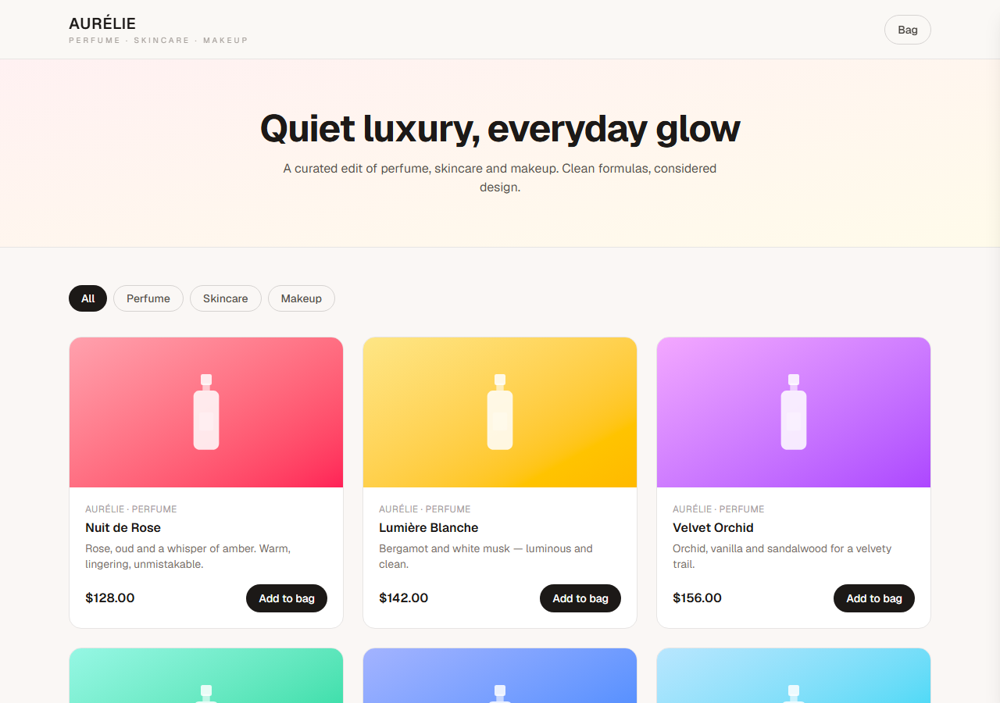

<!-- ══════════════════════════ PORTADA ══════════════════════════ -->
<div align="center">
  
</div>

<!-- ══════════════════════ IDIOMAS / LANGUAGES ══════════════════════ -->
<div align="center">
<a href="README.md"></a>
<a href="README.en.md"></a>
<a href="README.es.md"></a>
</div>

<div align="center">


</div>

<div align="center">
<a href="#acerca-de"></a>
<a href="#funcionalidades"></a>
<a href="#estructura"></a>
<a href="#uso"></a>
</div>

<br/>

> 🛍️ **Tienda de demostración** — el checkout es ilustrativo y no procesa pagos reales.

<div align="center">
  
</div>

## Acerca de

**Aurélie** es una tienda de e-commerce pequeña pero completa para perfumes, skincare y maquillaje, con bolsa de compras funcional. UI premium y responsiva, con visuales de producto generados por CSS (sin depender de imágenes externas, así que nada se rompe).

## Funcionalidades

- **Catálogo de productos** con filtro por categoría (Perfume / Skincare / Maquillaje).
- **Bolsa de compras** — agregar, cambiar cantidad, quitar, subtotal — en un panel lateral con badge de conteo en vivo.
- **Carrito persistente** vía React Context + `localStorage` (sobrevive al refresh).

## Estructura

```
src/
  app/page.tsx          # tienda (filtro + grid + carrito)
  components/           # Header, ProductCard, CartDrawer, BottleMark
  lib/products.ts       # datos del catálogo
  lib/cart.tsx          # contexto del carrito (localStorage)
```

## Uso

```bash
npm install
npm run dev      # http://localhost:3000
```

## Licencia

[MIT](LICENSE).

<div align="center">
  
</div>

<p align="center"><sub>Desarrollado por <strong><a href="https://github.com/geoggrigori">Grigori</a></strong> · 2026</sub></p>
